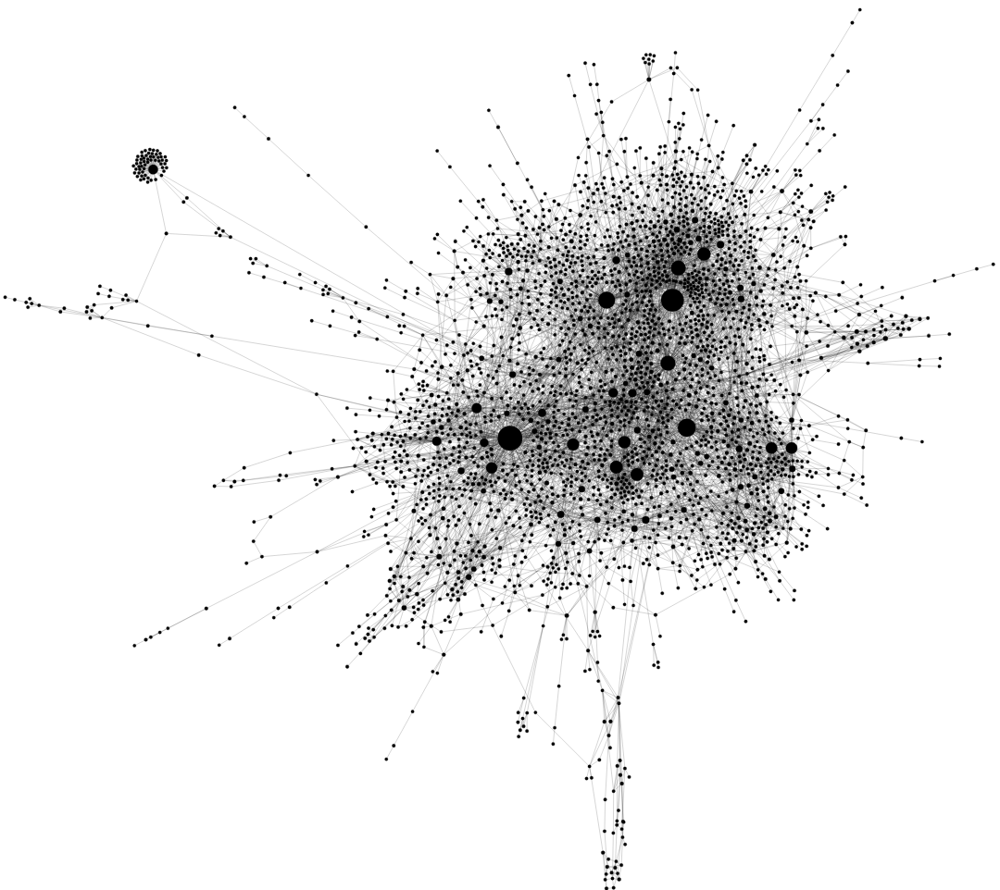
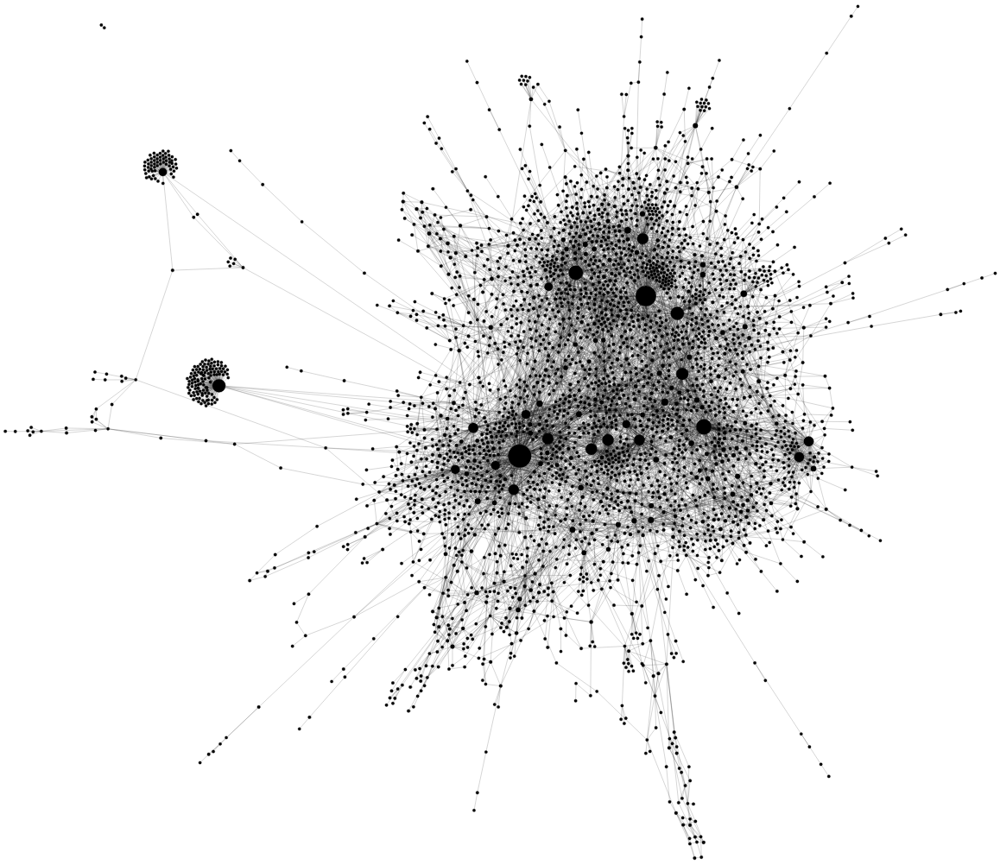

<!--

-->

<link rel="stylesheet" href="https://maxcdn.bootstrapcdn.com/bootstrap/4.0.0/css/bootstrap.min.css" integrity="sha384-Gn5384xqQ1aoWXA+058RXPxPg6fy4IWvTNh0E263XmFcJlSAwiGgFAW/dAiS6JXm" crossorigin="anonymous">

<link rel="stylesheet" href="https://cdnjs.cloudflare.com/ajax/libs/ekko-lightbox/5.3.0/ekko-lightbox.css" integrity="sha512-Velp0ebMKjcd9RiCoaHhLXkR1sFoCCWXNp6w4zj1hfMifYB5441C+sKeBl/T/Ka6NjBiRfBBQRaQq65ekYz3UQ==" crossorigin="anonymous" />

### Abstract

    "
    Due to the increasing number of new malware appearing daily, it is impossible to manually inspect each sample. By applying data mining techniques to detect malicious programs, we can help manual analysis, based on static as well as dynamic features. In this paper we propose a method to extract fingerprints from the executable binary, and evaluate these by applying community detection algorithms on the common fingerprints-based malware graph to identify families. The signatures are extracted via static code analysis, using n-grams obtained from the function call graph and applying locality-sensitive hashing to catch slight variations of the instruction sequences.
    "

### Keywords

`static call graph`,
`n-gram features`,
`locality-sensitive hashing`,
`malware communities`, 
`family clustering`

### Related work

    

        Fig. 1.Prevalent methods and feautures used for malware analysis 
        (based on <a href="#cite_1">[1]</a>)
    

    

        Fig. 2.Call graph-based malware analysis
        (based on <a href="#cite_1">[1]</a>)
    

### Figures

    

        Fig. 3.Louvain communities of the common fingerprints-based malware graph
    

    

    
    

    

    
    

    
    

        Fig. 4.Call graphs of two samples within the same community, having the same family
    

<bibtex src="bib.bib"></bibtex>

 
    

        

            []
        

        

            

                
                    , 
                
                
                
                    ,
                
                
                

                
                    <a class="url" style="color:black; font-size:10px" target="_blank">(view)</a>
                
                
                 
                
                    <a class="bibtexVar" style="color:black; font-size:10px" target="_blank" href="https://www.doi.org/+doi+" extra="doi">(view)</a>
                
                
                
            

            

                
            

        

    

### References

    

