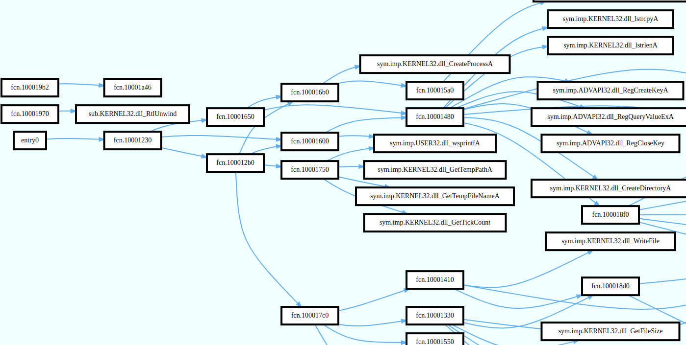
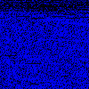

<!--

-->

<link rel="stylesheet" href="https://maxcdn.bootstrapcdn.com/bootstrap/4.0.0/css/bootstrap.min.css" integrity="sha384-Gn5384xqQ1aoWXA+058RXPxPg6fy4IWvTNh0E263XmFcJlSAwiGgFAW/dAiS6JXm" crossorigin="anonymous">
<link rel="stylesheet" href="https://cdn.jsdelivr.net/npm/bootstrap-icons@1.5.0/font/bootstrap-icons.css">

<link rel="stylesheet" href="https://cdnjs.cloudflare.com/ajax/libs/ekko-lightbox/5.3.0/ekko-lightbox.css" integrity="sha512-Velp0ebMKjcd9RiCoaHhLXkR1sFoCCWXNp6w4zj1hfMifYB5441C+sKeBl/T/Ka6NjBiRfBBQRaQq65ekYz3UQ==" crossorigin="anonymous" />

<link rel="stylesheet" href="./style.css" />

  
  

    <h5 class="card-title">Validating static call graph-based malware signatures using community detection methods</h5>
    
<a href="https://www.esann.org/esann21programme" target="blank">ESANN, 2021</a>

    <a href="papers/2021_esann" class="btn btn-primary">View</a>
    <a href="https://www.esann.org/sites/default/files/proceedings/2021/ES2021-27.pdf" target="blank"><i class="bi bi-paperclip"></i>Paper</a>
  

  
  

    <h5 class="card-title">Malware classification based on graph convolutional neural networks and static call graph features</h5>
    
<a href="https://ieaaie2022.wordpress.com/" target="blank">IEA/AIE, 2022</a>

    <a href="papers/2022_ieaaie" class="btn btn-primary">View</a>
    <a href="https://link.springer.com/chapter/10.1007/978-3-031-08530-7_45" target="blank"><i class="bi bi-paperclip"></i>Paper</a>
  

  
  

    <h5 class="card-title">Malware analysis and static call graph generation with Radare2</h5>
    

        <a href="https://www.cs.ubbcluj.ro/~studia-i/journal/journal/article/view/85" target="blank">
        Studia Universitatis Informatica, 2023
        </a>
    

    
    <a href="papers/2022_studia" class="btn btn-primary">View</a>
    <a href="https://www.cs.ubbcluj.ro/~studia-i/journal/journal/article/view/85/85" target="blank"><i class="bi bi-paperclip"></i>Paper</a>
    <a href="https://www.kaggle.com/competitions/malware-detection/data" target="_blank" class="btn">
        <i class="bi bi-file-earmark-fill"></i>
        Kaggle dataset
    </a>
  

  
  

  
  

  

    <h5 class="card-title">Towards a malware family classification model
using static call graph instruction visualization</h5>
    

        <a href="https://nsclab.org/nss-socialsec2024/papers.html" target="blank">
        NSS, 2024
        </a>
    

    

        Latest work
    

    <a href="papers/2024_nss" class="btn btn-primary">View</a>
    <a href="https://link.springer.com/chapter/10.1007/978-981-96-3531-3_9" target="blank"><i class="bi bi-paperclip"></i>Paper</a>
    

    <a href="https://github.com/attilamester/malflow" target="_blank" class="btn"><i class="bi bi-github"></i>
        malflow
    </a>
    <a href="https://www.kaggle.com/datasets/amester/malflow" target="_blank" class="btn">
        <i class="bi bi-file-earmark-fill"></i>
        Kaggle dataset
    </a>
    

  

<h3>Other</h3>

  
  

    <h5 class="card-title">Network Analysis Based on Important Node Selection and Community Detection</h5>
    

         <a href="https://www.mdpi.com/2227-7390/9/18/2294" target="blank">
        MDPI Mathematics, 2021
        </a>
    

    <a href="https://www.mdpi.com/2227-7390/9/18/2294" target="blank"><i class="bi bi-paperclip"></i>Paper</a>
  

  

     
  

  

    <h5 class="card-title">IT Days 2022</h5>
    <a href="https://www.2022.itdays.ro/presentation/Research-and-Academic-Initiatives-in-Cyber-Security-at-Babe%C8%99-Bolyai-University" target="blank"><i class="bi bi-paperclip"></i>Speaker</a>
  

<!--

  
  

    <h5 class="card-title">PhD defense 2025</h5>
  

-->

