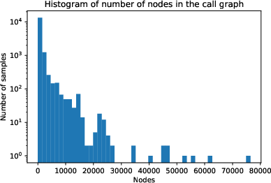
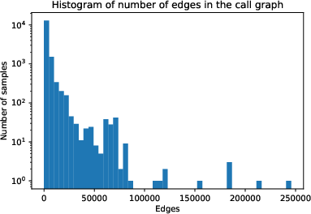

<link rel="stylesheet" href="../../style.css" />

<link rel="stylesheet" href="https://maxcdn.bootstrapcdn.com/bootstrap/4.0.0/css/bootstrap.min.css" integrity="sha384-Gn5384xqQ1aoWXA+058RXPxPg6fy4IWvTNh0E263XmFcJlSAwiGgFAW/dAiS6JXm" crossorigin="anonymous">

<link rel="stylesheet" href="https://cdnjs.cloudflare.com/ajax/libs/ekko-lightbox/5.3.0/ekko-lightbox.css" integrity="sha512-Velp0ebMKjcd9RiCoaHhLXkR1sFoCCWXNp6w4zj1hfMifYB5441C+sKeBl/T/Ka6NjBiRfBBQRaQq65ekYz3UQ==" crossorigin="anonymous" />

### About

* Presented at <a href="https://ieaaie2022.wordpress.com/" target="blank">IEA/AIE 2022</a>
* <a href="./ieaaie2022.pdf" target="_blank">Slides</a>

### Authors

* <a href="https://www.researchgate.net/profile/Zalan-Bodo">Zalán Bodó</a>
* <a href="https://www.researchgate.net/profile/Attila-Mester-2">Attila Mester </a>

### Abstract

    "

Advanced Persistent Threats (APT) are targeted, high level
cybersecurity risk factors facing governments, financial units and other
organizations. The attribution of APTs - gathering information about
the origin of an attack - is an important key in the process of securing
an organisation’s infrastructure, prioritizing the measures to be taken
depending on the actor(s) targeting the organisation. In practice, an elementary step in the process of attribution is determining the family
and/or author of a sample, based on the binary file and/or its dynamic
analysis - i.e. a multi-class classification problem regarding the family/author label. There are numerous methods in the literature aimed to
label a sample based on its control flow graph or API sequence graph.
We aim to summarize the literature on these methods, and offer another
method to classify malware families leveraging the static call graph of a
PE executable, as well as the functions’ instruction lists, using a locality-
sensitive hashing method to obtain the node feature vectors. Our results
are compared to recent publications in the field.

"

### Keywords

`static malware analysis`,
`static call graph`,
`graph convolutional neural networks`,
`locality-sensitive hashing`,
`family classification`

### Figures

    

        Fig. 1.Outline of the project: malware family classification using graph convolutional neural networks trained on static call graph
    

    

    
    

    

    
    

    
    

        Fig. 2.Histogram of number of nodes and edges in a call graph. 
    

