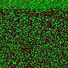

<link rel="stylesheet" href="../../style.css" />

<link rel="stylesheet" href="https://maxcdn.bootstrapcdn.com/bootstrap/4.0.0/css/bootstrap.min.css" integrity="sha384-Gn5384xqQ1aoWXA+058RXPxPg6fy4IWvTNh0E263XmFcJlSAwiGgFAW/dAiS6JXm" crossorigin="anonymous">

<link rel="stylesheet" href="https://cdnjs.cloudflare.com/ajax/libs/ekko-lightbox/5.3.0/ekko-lightbox.css" integrity="sha512-Velp0ebMKjcd9RiCoaHhLXkR1sFoCCWXNp6w4zj1hfMifYB5441C+sKeBl/T/Ka6NjBiRfBBQRaQq65ekYz3UQ==" crossorigin="anonymous" />

### About

* Presented at <a href="https://nsclab.org/nss-socialsec2024/" target="blank">NSS 2024</a>
* <a href="./nss.pdf" target="_blank">Slides</a>
* GitHub repository: <a href="https://github.com/attilamester/malflow" target="_blank">malflow</a>

### Authors

* <a href="https://www.researchgate.net/profile/Zalan-Bodo">Zalán Bodó</a>
* <a href="https://www.researchgate.net/profile/P-Vinod">Vinod P. </a>
* <a href="https://www.researchgate.net/profile/Mauro-Conti">Mauro Conti</a>
* <a href="https://www.researchgate.net/profile/Attila-Mester-2">Attila Mester </a>

### Abstract

    "
This paper offers yet another static analysis method aimed
at classifying malware families, by disassembling the executables with
Radare2 and traversing the static call graph to train CNNs on
instruction-based RGB images. The instruction-based family detection
should have the potential to model common behavioral patterns, thus
creating a profile for various families and actors. The experiments are
carried out on the BODMAS, MalImg, and IBD (internal Bitdefender
dataset). Our method’s performance is compared to another static fea-
ture selection method – the EMBER features. Furthermore, we reveal
proof of correlation between packers and malware families in all three
datasets. Our conclusion states that the proposed model’s accuracy does
not reach the EMBER feature’s performance due to the high number
of packed files in these datasets. However, its stability still motivates
its use since the instruction-based information cannot be altered easily
as header-based features – our observations infer that while classifying
malware families, ML methods which ignore unpacking the samples may
overfit the data, learning packer traits instead of actual family behaviour,
offering no explainability over the decision.
    "

### Keywords

`static malware analysis`,
`call graph`,
`control flow graph`,
`Radare2`,
`family classification`,
`packer`,
`BODMAS`,
`EMBER`,
`MalImg`

### Dataset

* published on Kaggle: [https://www.kaggle.com/datasets/amester/malflow](https://www.kaggle.com/datasets/amester/malflow)

### Figures

    

        Fig. 1.Outline of the project: static call graph instruction image generation and family classification using CNNs
    

    

    
    

    

    
    

    
    

        Fig. 2.Two samples from <b>ainslot</b> family, visualized by encoding their static call graph instructions 
    

    

    
    

    

    
    

    
    

        Fig. 3.Two samples from <b>allaple</b> family, visualized by encoding their static call graph instructions 
    

